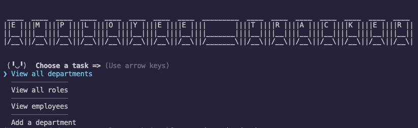

# Employee Tracker

## Description

A CLI application that manages a company's employee database using Node.js, Inquirer and MySQL.

GitHub repository: https://github.com/MrPolkadot/employee-tracker
Walkthrough video (screencastify): https://watch.screencastify.com/v/dVmLXtsMJ4RBPoMSsZal
(Google drive): https://drive.google.com/file/d/1b1w1lcqqta2ycD82qGOsebhcs4B8yVu1/view

## Installation

Must have node.js installed. Enter "npm install" or "npm i" in the terminal to install any needed dependencies.

## Usage

Enter "npm start" or "node main.js" to run the application.

## Contributing

Any contributions are welcome!

## License

This project is licensed under the MIT license.

## Contact-Me

You can contact me through my Github account and email:

- GitHub username: [MrPolkadot](github.com/MrPolkadot)
- Email: ceballos93@gmail.com
